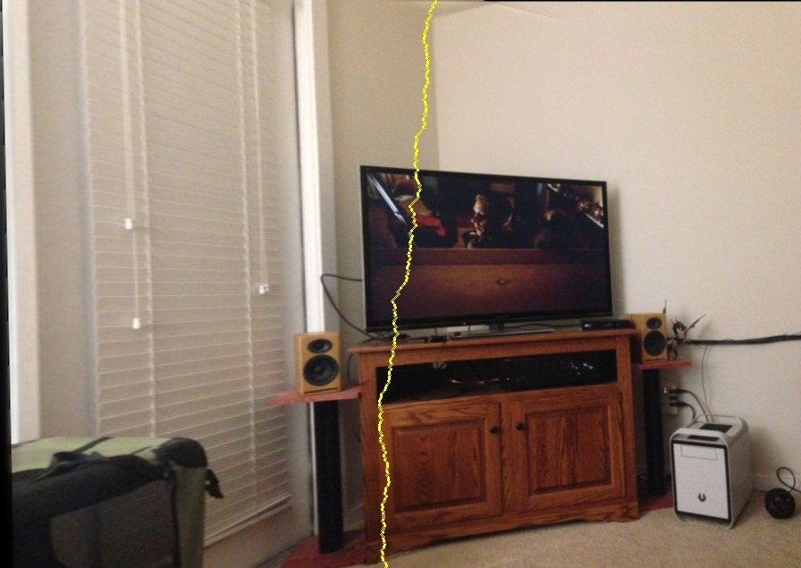
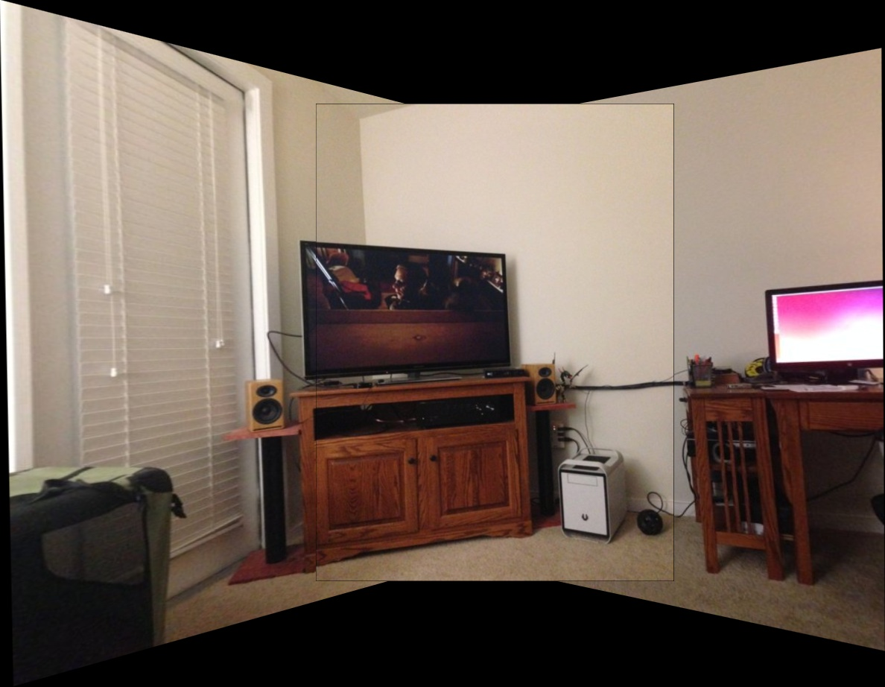
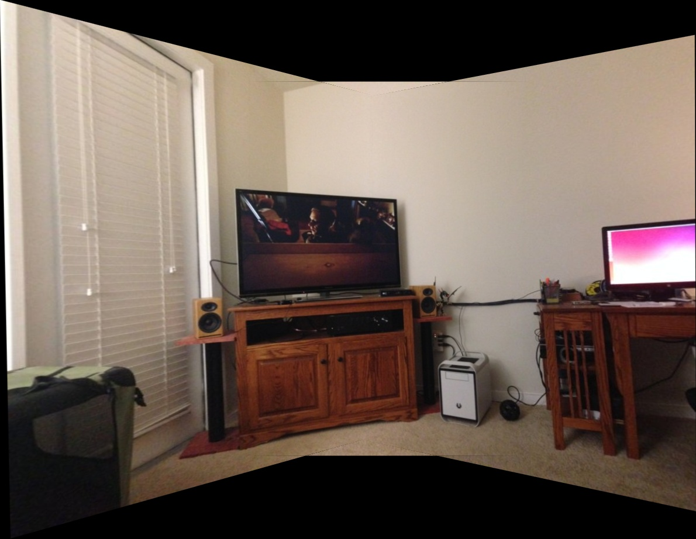
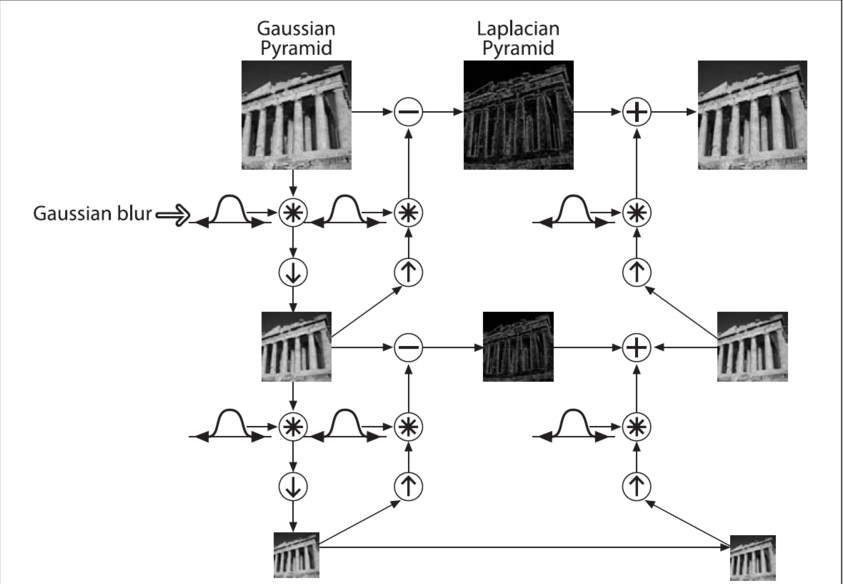
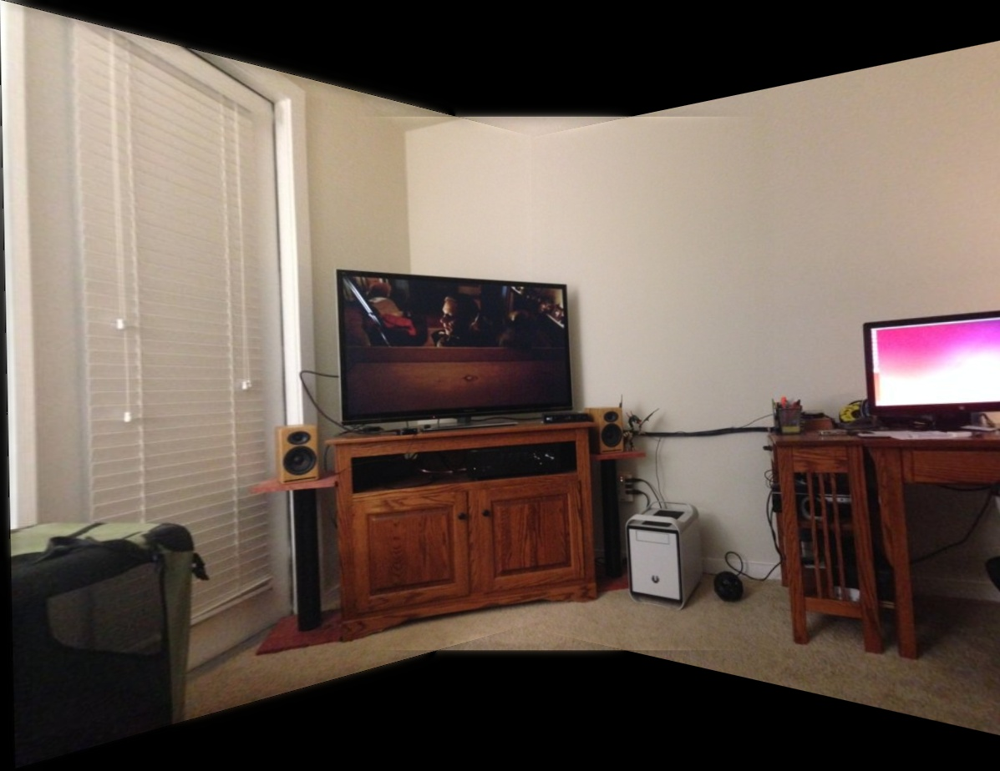
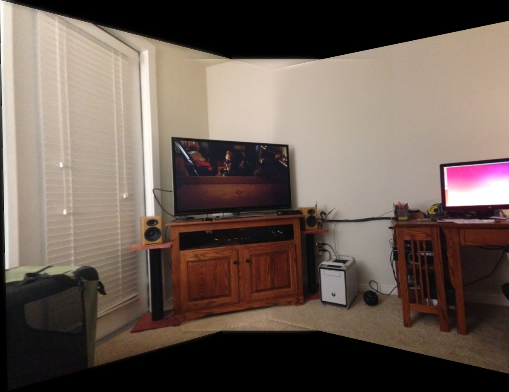

# Illumination Compensation

## Grey World

### Algorithm Principle

The grey world algorithm is based on the grey world hypothesis, which holds that for an image with a large number of
color changes, the average value of R, G, B components tends to be the same grey value grey. In physical sense, the
grey world method assumes that the average value of the average reflection of natural scenery to light is a fixed value,
which is approximately "grey". The color balance algorithm applies this assumption to the image to be processed, which
can eliminate the influence of ambient light from the image and obtain the original scene image.

There are generally two ways to determine the grey value

1. Using a fixed value, `128`is usually taken as the grey value for 8-bit images (`0-255`)
2. Calculate the gain coefficient, calculate the average value of `avgr,` `avgg` and `avgb `of three channels
   respectively, then:

$$
Avg=(avgR+avgG+avgB)\div3
$$

$$
kr=Avg\div avgR , kg=Avg\div avgG , kb=Avg\div avgB
$$


```python
def grey_world(nimg):
    nimg = nimg.transpose(2, 0, 1).astype(np.uint32)
    avgB = np.average(nimg[0])
    avgG = np.average(nimg[1])
    avgR = np.average(nimg[2])
    avg = (avgB + avgG + avgR) / 3
    nimg[0] = np.minimum(nimg[0] * (avg / avgB), 255)
    nimg[1] = np.minimum(nimg[1] * (avg / avgG), 255)
    nimg[2] = np.minimum(nimg[2] * (avg / avgR), 255)

    return nimg.transpose(1, 2, 0).astype(np.uint8)
```


## Histogram Equalization

### Algorithm Principle

The basic idea of histogram equalization is to transform the histogram of the original image into the form of uniform
distribution, so as to increase the dynamic range of pixel grey value, so as to enhance the overall contrast of the
image.

If the R, G and B channels of the color image are directly equalized and then merged, it is very easy to have the
problems of uneven color and distortion. Therefore, the`RGB` image is generally converted to `YCrCb` space to equalize
the Y channel (y channel represents the brightness component)

```python
# Histogram Equalization
def hist_equalization(img):
    ycrcb = cv.cvtColor(img, cv.COLOR_BGR2YCR_CB)
    channels = cv.split(ycrcb)
    cv.equalizeHist(channels[0], channels[0])  # equalizeHist(in,out)
    cv.merge(channels, ycrcb)
    img_eq = cv.cvtColor(ycrcb, cv.COLOR_YCR_CB2BGR)

    return img_eq
```

## Auto White Balance

### Algorithm Principle

A simple concept is used to explain what white balance is: suppose that the highest grey value of R, G and B in the
image corresponds to the white point in the image, and the lowest grey value corresponds to the darkest point in the
image; the grey value of the pixels in the three channels of R, G and B in the color image is mapped to the range of
[0.255] by $(AX + b)$ mapping function/

The essence of white balance is to make white objects appear white under any color light source. This is very easy for
the human eye to do, because the human eye has the ability to adapt itself. As long as the color of the light source
does not exceed a certain limit, it can automatically restore white. But the camera is different. Both the image sensor
and the film will record the color of the light source, and the white object will carry the color of the light source.
What the white balance needs to do is to remove the color deviation.

```python
def white_balance(img):
    rows = img.shape[0]
    cols = img.shape[1]
    final = cv.cvtColor(img, cv.COLOR_BGR2LAB)
    avgA = np.average(final[:, :, 1])
    avgB = np.average(final[:, :, 2])
    for x in range(final.shape[0]):
        for y in range(final.shape[1]):
            l, a, b = final[x, y, :]
            l *= 100 / 255.0
            final[x, y, 1] = a - ((avgA - 128) * (l / 100.0) * 1.1)
            final[x, y, 2] = b - ((avgB - 128) * (l / 100.0) * 1.1)
    final = cv.cvtColor(final, cv.COLOR_LAB2BGR)

    return final
```

## MSRCR

### Algorithm Principle

The theory of retina cerebral cortex `(Retinex)` holds that the world is colorless, and the world seen by human eyes is
the result of the interaction between light and matter. In other words, the image mapped to the human eye is related to
the long wave (R), medium wave (g), short wave (B) of light and the reflection property of objects.'''

illumination_compensation2 = r'''Where $I$ is the image seen in human eyes, $R$ is the reflection component of the
object, $l$ is the illumination component of the ambient light, and $(x, y)$ is the corresponding position of the
two-dimensional image.

It calculates $R$  by estimating $L$. Specifically, $L$ can be obtained by convolution operation of Gauss blur and $I$.
The formula is as follows:
$$
\log(R)=\log(I)-\log(L)
$$
$$
L=F\otimes I
$$
which, $\otimes$ represents convolution operation, and F is:
$$
F=\frac{1}{\sqrt{2\pi}\sigma}exp(\frac{-r^2}{\sigma^2})
$$
Among them, $σ$ is called Gaussian surround space constant, which has a great impact on image processing.

Detailed formula principle reference the [blog](https://blog.csdn.net/ajianyingxiaoqinghan/article/details/71435098)


# Best Seam

Stitch a series of images into one panorama may result in ghosting in the overlapping parts. Some algorithms, like
point-by-point method based on distance, dynamic programming, maximum flow cutting, are used to find a best seam. In our
project, we adopt dynamic programming to find a path with the minimum energy. As for the calculation of energy $E(x, y)$
, the formula is as follows,
$$
E(x, y)=E_{c}(x, y)^{2}+E_{g}(x, y)
$$
where $E_{c}$ is the difference between two overlapping points, $E_{g}$ is the difference of structures in the point
which shall be calculated by **Sobel Operator**.
$$
S_{x}=\left[\begin{array}{ccc}
-2 & 0 & 2 \\
-1 & 0 & 1 \\
-2 & 0 & 2
\end{array}\right] \quad S_{y}=\left[\begin{array}{ccc}
-2 & -1 & -2 \\
0 & 0 & 0 \\
2 & 1 & 2
\end{array}\right]
$$

$$
E_{g}=\operatorname{Diff}\left(I_{1} x, I_{2} x\right) \cdot \operatorname{Diff}\left(I_{1} y, I_{2} y\right)
$$

With $E$ calculated, find the path with the minimum energy amount.

1. In the overlapping part, from the first row, calculate energy for every points.
2. For one point, calculate energy for points in the bottom left, bottom and bottom right of current point ,get the
   minimum cumulative energy and record the column.
3. When reaching the last row, choose the column with the minimum cumulative energy and set the path as the best seam.

```
def cal_energy_map(left_img, right_img): ……
def find_seam(left_img, right_img, min_indy, max_indy, min_indx, max_indx, is_debug=False): ……
```



# Blending

## Direct Blending

Use the overlay method for fusion, that is, the two pictures to be fused are directly superimposed together, and the
overlapping part only takes the pixel value of one of the pictures

```python
# tmp base 为两张尺寸相同的待融合的图片
mask1 = np.logical_and(np.ones_like(tmp), tmp)
mask2 = np.logical_and(np.ones_like(base), base)
overlap = np.logical_and(mask1, mask2)
mask1 = np.uint8(mask1) - np.uint8(overlap)
mask2 = np.uint8(mask2)

base = base * mask2
tmp = mask1 * tmp
tmp += base
```



## Middle Line Blending

Taking the midline of the coincident area as the boundary, the two sides are the pixel values of the two pictures.

```python
def middleBlender(self, tmp, base, dsize, direction):
    # Blending 2
    left = 0
    right = 0
    if direction == "left":
        for col in range(0, dsize[0]):
            if base[:, col].any() and tmp[:, col].any():
                left = col
                break
           for col in range(dsize[0] - 1, 0, -1):
            if base[:, col].any() and tmp[:, col].any():
                right = col
                break

        for row in range(0, dsize[1]):
            for col in range(left, dsize[0]):
                if not base[row, col].any():
                    tmp[row, col] = tmp[row, col]
                elif not tmp[row, col].any():
                    tmp[row, col] = base[row, col]
                else:
                    baseImgLen = float(abs(col - right))
                    tmpImgLen = float(abs(col - left))
                    alpha = baseImgLen / (baseImgLen + tmpImgLen)
                    if alpha < 0.5:
                           tmp[row, col] = base[row, col]
    else:
    left = 0
    right = 0
    for col in range(0, dsize[0]):
        if base[:, col].any() and tmp[:, col].any():
            left = col
            break
    for col in range(dsize[0] - 1, 0, -1):
        if base[:, col].any() and tmp[:, col].any():
            right = col
            break

    for row in range(0, dsize[1]):
        for col in range(0, right):
            if not base[row, col].any():
                tmp[row, col] = tmp[row, col]
            elif not tmp[row, col].any():
                tmp[row, col] = base[row, col]
            else:
                baseImgLen = float(abs(col - left))
                tmpImgLen = float(abs(col - right))
                alpha = baseImgLen / (baseImgLen + tmpImgLen)
                if alpha < 0.5:
                    tmp[row, col] = base[row, col]

return tmp
```


## Weighted Average Blending

Based on the left and right boundary points of the coincident area, the weight transform `1.0` to `0.0` from left to
right.

```python
def averageBlender(self, tmp, base, dsize, direction, mask=None):
    # Blending 1
    left = 0
    right = 0
    if mask is None:
        mask = np.zeros_like(tmp)
    if direction == "left":
        for col in range(0, dsize[0]):
            if base[:, col].any() and tmp[:, col].any():
                left = col
                break
        for col in range(dsize[0] - 1, 0, -1):
            if base[:, col].any() and tmp[:, col].any():
                right = col
                break

        for row in range(0, dsize[1]):
            for col in range(left, dsize[0]):
                if not base[row, col].any():
                    tmp[row, col] = tmp[row, col]
                elif not tmp[row, col].any():
                    tmp[row, col] = base[row, col]
                else:
                    baseImgLen = float(abs(col - right))
                    tmpImgLen = float(abs(col - left))
                    alpha = baseImgLen / (baseImgLen + tmpImgLen)
                    mask[row, col] = alpha
                    tmp[row, col] = np.clip(base[row, col] * (1 - alpha) + tmp[row, col] * alpha, 0, 255)
    else:
        for col in range(0, dsize[0]):
            if base[:, col].any() and tmp[:, col].any():
                left = col
                break
        for col in range(dsize[0] - 1, 0, -1):
            if base[:, col].any() and tmp[:, col].any():
                right = col
                break

        for row in range(0, dsize[1]):
            for col in range(0, right):
                if not base[row, col].any():
                    tmp[row, col] = tmp[row, col]
                elif not tmp[row, col].any():
                    tmp[row, col] = base[row, col]
                else:
                    baseImgLen = float(abs(col - left))
                    tmpImgLen = float(abs(col - right))
                    alpha = baseImgLen / (baseImgLen + tmpImgLen)
                    mask[row, col] = alpha
                    tmp[row, col] = np.clip(base[row, col] * (1 - alpha) + tmp[row, col] * alpha, 0, 255)

    return tmp, mask
```



## Laplacian Pyramid Blending

Based on the left and right boundary points of the coincident area, the weight transform `1.0` to `0.0` from left to
right.

```python
def averageBlender(self, tmp, base, dsize, direction, mask=None):
    # Blending 1
    left = 0
    right = 0
    if mask is None:
        mask = np.zeros_like(tmp)
    if direction == "left":
        for col in range(0, dsize[0]):
            if base[:, col].any() and tmp[:, col].any():
                left = col
                break
        for col in range(dsize[0] - 1, 0, -1):
            if base[:, col].any() and tmp[:, col].any():
                right = col
                break

        for row in range(0, dsize[1]):
            for col in range(left, dsize[0]):
                if not base[row, col].any():
                    tmp[row, col] = tmp[row, col]
                elif not tmp[row, col].any():
                    tmp[row, col] = base[row, col]
                else:
                    baseImgLen = float(abs(col - right))
                    tmpImgLen = float(abs(col - left))
                    alpha = baseImgLen / (baseImgLen + tmpImgLen)
                    mask[row, col] = alpha
                    tmp[row, col] = np.clip(base[row, col] * (1 - alpha) + tmp[row, col] * alpha, 0, 255)
    else:
        for col in range(0, dsize[0]):
            if base[:, col].any() and tmp[:, col].any():
                left = col
                break
        for col in range(dsize[0] - 1, 0, -1):
            if base[:, col].any() and tmp[:, col].any():
                right = col
                break

        for row in range(0, dsize[1]):
            for col in range(0, right):
                if not base[row, col].any():
                    tmp[row, col] = tmp[row, col]
                elif not tmp[row, col].any():
                    tmp[row, col] = base[row, col]
                else:
                    baseImgLen = float(abs(col - left))
                    tmpImgLen = float(abs(col - right))
                    alpha = baseImgLen / (baseImgLen + tmpImgLen)
                    mask[row, col] = alpha
                    tmp[row, col] = np.clip(base[row, col] * (1 - alpha) + tmp[row, col] * alpha, 0, 255)

    return tmp, mask
```



The input `mask` represents the location of the blending. The weights are used to add the two
images layer by layer to form a new pyramid, and then the image is reconstructed by up sampling.

```python
def laplacian_blending(img1, img2, mask, levels=4):
    G1 = np.float32(img1)
    G2 = np.float32(img2)
    GM = np.float32(mask)
    gaussPyr1 = [G1]
    gaussPyr2 = [G2]
    gaussPyrM = [GM]

    # Generate Gaussian Pyramids
    for i in range(levels):
        G1 = cv2.pyrDown(G1)
        G2 = cv2.pyrDown(G2)
        GM = cv2.pyrDown(GM)
        gaussPyr1.append(G1)
        gaussPyr2.append(G2)
        gaussPyrM.append(GM)

    # Generate Laplacian Pyramids
    laplacianPyr1 = [gaussPyr1[levels - 1]]
    laplacianPyr2 = [gaussPyr2[levels - 1]]
    laplacianPyrM = [gaussPyrM[levels - 1]]
    for i in range(levels - 1, 0, -1):
        dstsize = (gaussPyr1[i-1].shape[1], gaussPyr1[i-1].shape[0])
        temp_pyrup1 = cv2.pyrUp(gaussPyr1[i], dstsize=dstsize)
        temp_pyrup2 = cv2.pyrUp(gaussPyr2[i], dstsize=dstsize)
        L1 = np.subtract(gaussPyr1[i - 1], temp_pyrup1)
        L2 = np.subtract(gaussPyr2[i - 1], temp_pyrup2)
        laplacianPyr1.append(L1)
        laplacianPyr2.append(L2)
        laplacianPyrM.append(gaussPyrM[i - 1])

    # Now blend images according to mask in each level
    LS = []
    for l1, l2, lm in zip(laplacianPyr1, laplacianPyr2, laplacianPyrM):
        ls = l1 * lm + l2 * (1.0 - lm)
        LS.append(ls)

    # Now reconstruct
    ls_reconstruct = LS[0]
    for i in range(1, levels):
        ls_reconstruct = cv2.pyrUp(ls_reconstruct, dstsize=(LS[i].shape[1], LS[i].shape[0]))
        ls_reconstruct = cv2.add(ls_reconstruct, LS[i])

    return np.uint8(np.clip(ls_reconstruct, 0, 255))
```

### Middle Line Blending

The `mask` with the middle line of the coincidence region as weight of `0.5`, the left boundary as `1.0`, and the
right boundary as `0.0` is the `mask` of Laplacian blending.



### Optimal Graph Cut Blending

The optimal suture line is found by dynamic programming, and then the `mask` is constructed with the weight of `0.5`.


