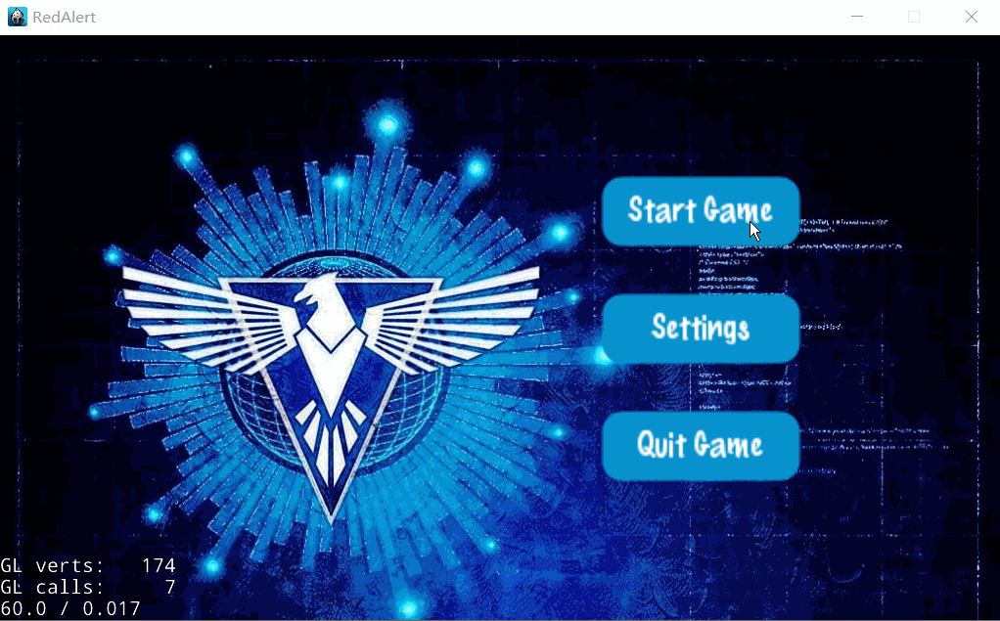

## Introduction

*Our-Red-Alert* is a real-time strategy (RTS) game that supports battles of up to four players, offering local area network (LAN) connectivity for engaging multiplayer face-offs. 
In-game, players must harness resources continuously generated by their base and various structures to produce combat units. 
The ultimate victory lies in demolishing the enemy's base while ensuring your own remains unscathed.

### Game System Requirements:
* Operating Platform: Windows
* Minimum Disk Space Required: 100 MB

### Supported Game Operations

|                                                            Action                                                            |                                                   Effect                                                    |
|:----------------------------------------------------------------------------------------------------------------------------:|:-----------------------------------------------------------------------------------------------------------:|
|                                                       Click Main Base                                                        |                                          Summon construction menu                                           |
|                                                        Click Barracks                                                        |                                Summon production menu for dogs and soldiers                                 |
|                                                      Click War Factory                                                       |                                Summon production menu for tanks and fighters                                |
|                                                     Mouse to Screen Edge                                                     |            Move the map when within 10 ~ 40 pixels from the edge, speed doubles at 0 ~ 10 pixels            |
|                                                        Click Mini-map                                                        |                                   Map moves to the corresponding location                                   |
|                                         Click on a building in the construction menu                                         |                  Then click within a valid area of the main base to construct the building                  |
|                                            Click on a unit in the production menu                                            |                               Produce the unit in the corresponding building                                |
|                                      Click (box select) units then click an empty area                                       | Units will move to that location (if the spot is in an immovable area, they will move as close as possible) |
|                                      Click (box select) units then click an enemy unit                                       |          Units will approach the enemy unit and attack, if not attackable, they will only approach          |
| Click the chat box's InputBar, type a single line of text, then click any empty space on the game map, and hit the Enter key |                                    Send a message visible to all players                                    |
|                                                  Press the Blank Space key                                                   |                                             Return to main base                                             |
|                                               Press Up, Down, Left, Right keys                                               |                              Move the map up, down, left, right, respectively                               |

### Attributes of Various Combat Units

| Unit Name |                  Trait                  | Attack Power | Attack Interval | Health | Mobility | Attack Range | Construction Duration | Construction Cost |
|:---------:|:---------------------------------------:|:------------:|:---------------:|:------:|:--------:|:------------:|:---------------------:|:-----------------:|
|  War Dog  | Attacks only soldiers, kills in one hit |      5       |        2        |   1    |    5     |      1       |           2           |         1         |
|  Soldier  |           Balanced attributes           |      3       |        1        |   3    |    3     |      3       |           3           |         2         |
|   Tank    |   High durability, powerful firepower   |      5       |        5        |   10   |    4     |      5       |           8           |         5         |
|   Plane   |  High mobility, extremely destructive   |      8       |        5        |   7    |    10    |      5       |          10           |        10         |

## Game Loading Methods
### Server Port Launch Instructions
1. Extract the compressed package to your hard drive.
2. Open `RedAlert.exe` and click the `Start Game` button.
3. Click `Create Game` to enter the Server interface.
4. Select a map to serve as the game map (default is `LostCity` as the main game map).
5. Click `Start Server` to create the game server.
6. Wait for Client players to join until the number of connections displayed on the right reaches 2 or more.
7. Click `Start Game` to enter the game environment.

### Client Port Launch Instructions
1. Follow steps 1 and 2 of the Server Port Launch Instructions.
2. Click `Join Game` to enter the list of rooms.
3. Enter the server's IPv4 address in the input box.
4. Click `Start Game` to connect to the server.
5. Wait for the Server's response; when the Server player issues the command to start the game, you will enter the game environment.

### Single Platform Demonstration and Testing Method
1. The Server port opening method is the same as above.
2. For the Client port, use the default IP address parameter.

