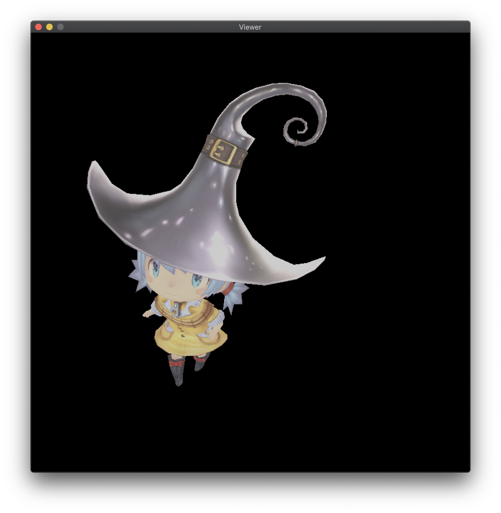
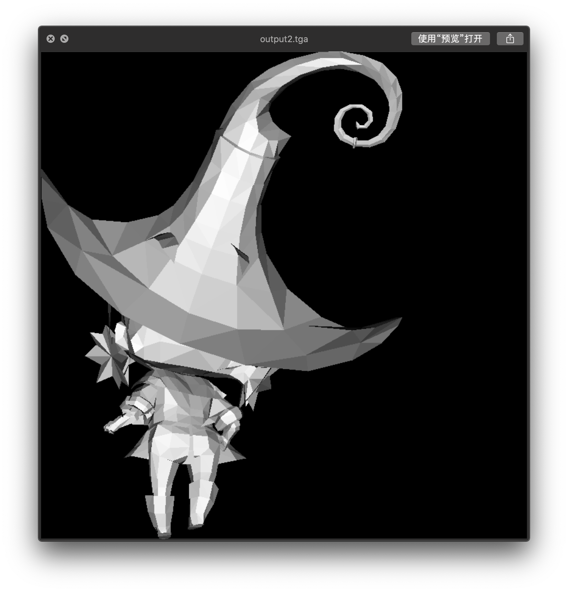

## 1. Introduction

### 1.1 Functionality

- [x] Line drawing algorithm
- [x] GUI drawing
- [x] Triangle rasterization
- [x] Vertex transformation
- [x] View transformation
- [x] Perspective interpolation
- [x] Texture mapping
- [x] Shaders (vertex shader, fragment shader)
- [x] Shadow mapping
- [x] Ambient occlusion

### 1.2 Running Instructions

- This project uses CMake tool to support cross-platform compilation. The specific compilation methods are as follows:

  - DEBUG mode:

      ```shell
      $ mkdir Debug
      $ cd Debug
      $ cmake -DCMAKE_BUILD_TYPE=Debug ..
      $ make
      ```

  - RELEASE mode:

      ```shell
      $ mkdir Release
      $ cd Release
      $ cmake -DCMAKE_BUILD_TYPE=Release ..
      $ make
      ```

- If CMake tool is not available, Visual Studio on Windows platform can be used to import CMake projects.

- When running the compiled program, please attach runtime parameters, which are the addresses of the OBJ files used for rendering. If there are multiple files, input their addresses in order, separated by spaces (the order of the files is the order in which the renderer renders them).

  - Mac OS X terminal:

      ```
      ./Viewer ../obj/boggie/body.obj ../obj/boggie/head.obj ../obj/boggie/eyes.obj
      ```

  - Windows terminal:

      ```
      ./Viewer.exe ../obj/boggie/body.obj ../obj/boggie/head.obj ../obj/boggie/eyes.obj
      ```

  - IDE configuration (such as CLion, Visual Studio, etc.)

    Add the above parameters to the program parameters field in the project configuration information:

      ```
      ../obj/boggie/body.obj ../obj/boggie/head.obj ../obj/boggie/eyes.obj
      ```

### 1.3 Operating Instructions

| Key | Description                                                                                                                                                          |
|:---:|----------------------------------------------------------------------------------------------------------------------------------------------------------------------|
| `A` | Rotate the camera to the left around the center of the model                                                                                                         |
| `D` | Rotate the camera to the right around the center of the model                                                                                                        |
| `W` | Rotate the camera upwards around the center of the model. In order to avoid the inversion of the viewpoint, the movement cannot be continued after a certain angle   |
| `S` | Rotate the camera downwards around the center of the model. In order to avoid the inversion of the viewpoint, the movement cannot be continued after a certain angle |
| `1` | Switch to normal rendering mode                                                                                                                                      |
| `2` | Switch to depth shader rendering mode                                                                                                                                |
| `3` | Switch to shadow shader rendering mode                                                                                                                               |
| `4` | Switch to ambient occlusion shader rendering mode                                                                                                                    |
| `5` | Switch to wireframe rendering mode                                                                                                                                   |

### 1.4 Running Examples

<table>
    <tr>
        <td>
            
            <figcaption align="center">Fig 1. Normal rendering mode</figcaption>
        </td>
        <td>
            
            <figcaption align="center">Fig 2. Depth shader rendering mode</figcaption>
        </td>
    </tr>
    <tr>
        <td>
            
            <figcaption align="center">Fig 3. Shadow shader rendering mode</figcaption>
        </td>
        <td>
            
            <figcaption align="center">Fig 4. Ambient occlusion shader rendering mode</figcaption>
        </td>
    </tr>
</table>

## 2. TGA Images and Window Drawing

### 2.1 Introduction to TGA Image Format

TGA is an image file format developed by Truevision for its display card, which has been accepted by the graphics and image industry internationally. It has become a common format for digital images and high-quality images generated by ray tracing algorithms. The extension of TGA files is .tga. The format supports compression and uses lossless compression algorithms. It can also carry channel images and supports run-length encoding compression. For a detailed description of TGA files, refer to the [truevision technical guide appendix](http://tfc.duke.free.fr/coding/tga_specs.pdf).

### 2.2 Why Choose TGA Image Format

We read and generate TGA images for material images and rendered images respectively in our renderer, for the following reasons:

- Simple encoding method. Since our goal is to minimize the dependence on external libraries (such as OpenGL, OpenCV, etc.), we choose image formats with simple encoding methods as much as possible.
- Support for multiple image formats. The TGA format indicates its corresponding file type through a field in the file header. We use several commonly used types, namely RGB/RGBA/black and white formats.
- Reading and writing images is relatively easy. Many source codes for reading and writing TGA images can be found online, so we do not need to focus too much on the file format problem, but only need to calculate the pixel values of each pixel when reading and writing images.

### 2.3 Window Drawing

Our window drawing code mainly refers to the method of [Software Renderer - A shader-based software renderer written from scratch in C89](https://zauonlok.github.io/renderer/), and uses system APIs to implement a simple graphical interface, only providing functions such as opening windows, displaying rendered images, adjusting rendering perspectives, and rendering modes.

Since our team divided the task, the display of the window is a separate module. In order to reduce the coupling with other parts of the renderer, our window outputs one frame rendered to the window, and recalculates this frame in the loop when the perspective moves. Therefore, the card phenomenon is quite obvious, and it cannot achieve real-time rendering effect.


## 3. Bresenhams' Line Algorithm

This part of the algorithm mainly refers to [Wikipedia - Bresenham's line algorithm](https://en.wikipedia.org/wiki/Bresenham%27s_line_algorithm) and the materials on the courseware. Later, due to the high cost of floating-point operations, the floating-point operations were optimized using integer operations, and the performance of the two was tested and compared.

### 3.1 Generalization

For the line determined by two points $(x_0,y_0)$ and $(x_1,y_1)$, since $x$ and $y$ are integers, it is not necessary to calculate the $y$ value corresponding to each point $x$. Instead, we can find out when $x$ reaches which value, $y$ will rise by 1. To do this, we need to calculate the slope of the line and the error between each pixel point and the line. When the error exceeds 0.5, the line will be closer to the next mapped point, so the value of $y$ will be added by 1. When the slope is greater than 1, only exchange $x$ and $y$ in the entire calculation range. When the slope is negative, set `ystep` to $-1$.

### 3.2 Optimization

Since the speed of floating point arithmetic is slower than that of integer arithmetic, the calculation of `error` and `deltaerr` in the above code are all floating point arithmetic. In addition, the value of `error` may accumulate errors after multiple floating point additions. Using integer arithmetic can make the algorithm faster and more accurate. As long as we multiply all the fractional values above by `deltax`, we can represent them with integers. The only problem is the constant value `0.5` in the program - we can solve it by changing the initial value of `error` and changing the calculation of `error` from increment to decrement.


### 3.3 Performance Comparison

We drew three million lines in our program and tested the CPU time consumed by the two line-drawing algorithms. We used the `g++ -ggdb -g -pg -O0` command to track the total time `line()` function was called:

| Algorithm      | line() execution time | line() call time as a percentage of total time |
|----------------|-----------------------|------------------------------------------------|
| Floating-point | 0.47s                 | 59.65%                                         |
| Integer        | 0.41s                 | 53.27%                                         |

As can be seen, the optimized version has a slight improvement, and even with all optimizations turned off (-O0), the difference between the two is not significant. It can be concluded that floating-point operations are not the performance bottleneck in line-drawing algorithms, and after enabling -O3 compilation optimization, these differences are basically eliminated.

### 3.4 Wireframe Rendering

After completing the line-drawing algorithm, we can create a wireframe renderer. We use the Wavefront obj format file to save the model. The format file uses `v x y z` to represent a geometric vertex and `f v1/vt1/vn1 v2/vt2/vn2 v3/vt3/vn3` and other methods to describe surface elements, which is not described in detail here.

We only need to read each model file in the program, then read each triangle in it, project all three vertices onto the xy coordinate plane (taking only the $x$ and $y$ values from their three-dimensional coordinates), and use the above line-drawing algorithm to draw the wireframe diagram on the xy coordinate plane.


## 4. Triangular Rasterization and Backface Culling

### 4.1 Scanline Polygon Fill Algorithm

The principle of the scanline polygon fill algorithm for a triangle is somewhat similar to the polygon scan conversion algorithm (new edge table and active edge table) discussed in class, but there are fewer cases to consider and the implementation is relatively simpler. For a regular triangle, we only need to sort its three vertices in order and then divide the triangle into upper and lower parts based on the middle vertex (for a triangle with one side parallel to the horizontal line, we can consider that the triangle only contains the upper or lower part). Then, we only need to find the intersection points between the horizontal scanline and the two triangles and fill pixels between the two intersection points.

Since the principle of this part is simple, the implementation code and results are omitted. This is because the algorithm actually used in our project will be discussed later.

### 4.2 Barycentric Coordinate Interpolation Algorithm

You can first refer to the definition of barycentric coordinates and the method for calculating the barycentric coordinates of a triangle on the [Wikipedia - Barycentric Coordinate]((https://zh.wikipedia.org/wiki/重心坐标)) page.

The steps of the algorithm are as follows:

1. For a triangle on the plane, find the boundaries of its rectangular bounding box;
2. For each pixel point $P$ in the bounding box, call the barycentric() function to calculate the cross product;
3. If any value in the returned vector of the function is less than $0$, it indicates that the point $P$ is not inside the triangle, otherwise draw the point $P$.


### 4.3 Backface Culling

Backface culling is a widely used algorithm to remove the invisible parts of a 3D model. The main idea is to discard all triangles whose surface normal vector has a dot product greater than or equal to 0 with the vector pointing from the camera to the triangle. In other words, the triangle is facing away from the camera and thus belongs to the backside.

The surface normal vector of a triangle can be obtained by taking the cross product of its two edge vectors. This algorithm relies on the ordering of vertices when constructing the polygons, and graphics libraries such as OpenGL usually define the front-facing direction based on vertex winding order.

The following images demonstrate the effect of backface culling when applied to a model with clockwise and counterclockwise vertex winding order.


<table>
    <tr>
        <td>
            
            <figcaption align="center">Counterclockwise vertex order (front)</figcaption>
        </td>
        <td>
            
            <figcaption align="center">Clockwise vertex order (back)</figcaption>
        </td>
    </tr>
</table>

## 5. Coordinate Transformation

### 5.1 Coordinate Transformation in the Pipeline


When a model is imported, it has its own coordinate system known as the model coordinate system. We need to transform it into a unified world coordinate system. Since we can observe the model from different viewpoints, a stationary object in the world coordinate system may appear differently in the camera coordinate system. Thus, we need to obtain its coordinate in the camera coordinate system using the camera matrix. After the object is projected onto the clipping coordinate system by the projection matrix, clipping is performed within the visible area. The object is then projected onto the normalized device coordinate system after perspective transformation, and finally translated and scaled to obtain the coordinates displayed on the screen.

### 5.2 Derivation of the Camera Matrix


From intuition, it can be seen that by transforming the camera coordinate system with the object into the world coordinate system, we can obtain the coordinate of the object in the transformed camera coordinate system.

In this project, for the sake of convenience in implementation, we fixed the camera on the Z-axis and achieved transformation by changing the target position.


## 6. Other Operations

### 6.1 Perspective Interpolation Correction

**Incorrect Perspective Interpolation**


Suppose c is the midpoint of a and b. If we simply interpolate it, the intensity of c would be 0.5, which is inconsistent with the initial primitive.

Therefore, the result obtained by simple linear interpolation is not entirely correct.

However, we can use some functions to obtain the correct result.

**Perspective interpolation correction proof**


As shown in the figure, s is the interpolation parameter on the image plane, and t is the interpolation parameter on the primitive.

### 6.2 Z-buffer

When we observe any opaque object in space, we can only see the surfaces of the object facing us, and the other surfaces that are obscured by the object are invisible to us.

If visible and invisible lines are drawn together, it will cause ambiguity in the visual perception. To eliminate ambiguity, it is necessary to eliminate hidden lines or hidden surfaces that are obscured during drawing, which is commonly referred to as hidden surface removal or hidden line removal, abbreviated as hidden surface removal.

Z-buffer is a commonly used hidden surface removal algorithm.

```
1. Initialize a storage space with the same size as the frame buffer
2. Set the initial value of each unit in the z-buffer to the minimum value
3. When changing the color value of a pixel, first check if the depth value of the current polygon is greater than the original depth value of the pixel
4. If the depth value of the current polygon is greater than the original z value, it means that the current polygon is closer to the viewpoint, so use its color to replace the original color of the pixel
```

## 7. Shader

### 7.1 Texture Mapping

<table>
	<tr>
    	<td>
            
            <center><figcaption>diffuse</figcaption></center>
    	</td>
        <td>
            
            <center><figcaption>normal</figcaption></center>
        </td>
        <td>
            
            <center><figcaption>specular</figcaption></center>
        </td>
    </tr>
</table>

#### 7.1.1 Diffuse Mapping

Diffuse mapping represents the reflection and surface color of an object. In other words, it can show the color and intensity of an object that is illuminated. We create a diffuse map by using colors and brightness to depict the surface of an object. In this map, the parts that absorb more light are darker, while the parts that reflect more light are brighter.

```c++
float intensity = _intensity_value * bar;
Vecf2 uv = _uv_value * bar;
color = model->diffuse(uv)*intensity;
```

#### 7.7.2 Normal Mapping

Normal mapping is a technique of assigning normal vectors to each point on the surface of an object with uneven features, by encoding the normal vectors in the RGB color channels of a texture map. These normal vectors appear to create an entirely new surface on top of the original object's surface, which is smoother and more efficient in terms of visual effects. By applying light sources to specific positions, normal mapping can provide highly detailed and accurate lighting and reflection effects, even on low-detail surfaces.

#### 7.7.3 Specular Mapping

A specular map, also known as a gloss map or highlight map, is used to represent the surface property of a model when it is illuminated by light. Different materials reflect different amounts of light, such as metal and skin, fabric, plastic, etc., which can be distinguished by using specular maps. Specular maps mainly represent specular reflection and highlight color of the object surface.

### 7.2 General Shader

In texture shading, the fragment shader performs shading based on diffuse texture, normal map, and specular map.


### 7.3 Depth Shader

In the depth shader, the fragment shader performs shading based on depth values, using the light source as the camera viewpoint.


### 7.4 Shadow Shader

The shadow shader first calls the depth shader to record the shadow area using a shadow buffer. In the second shading pass, shadow mapping is performed based on the shadow buffer.


### 7.5 Ambient Occlusion

Assuming that each pixel reflects ambient light equally in all eight neighboring directions, the light intensity of each pixel is recorded using z-buffer and treated as a height map. The maximum slope in each of the eight directions is calculated, and the solid angle is estimated based on the slope. This solid angle is then used as a parameter for shading.


## 8. References

- [TinyRenderer](https://github.com/ssloy/tinyrenderer/wiki)
- [知乎 - 如何开始用 C++ 写一个光栅化渲染器？](https://www.zhihu.com/question/24786878)
- [truevision的技术指南附录 - TGA Image Format](http://tfc.duke.free.fr/coding/tga_specs.pdf)
- [GitHub - GLFW Source Code](https://github.com/glfw/glfw)
- [Software Renderer - A shader-based software renderer written from scratch in C89](https://zauonlok.github.io/renderer/)
- [维基百科 - 重心坐标](https://zh.wikipedia.org/wiki/重心坐标)
- [维基百科 - 布雷森汉姆直线算法](https://zh.wikipedia.org/wiki/布雷森漢姆直線演算法)
- [CSDN Blog -  SoftRenderer&RenderPipeline（从迷你光栅化软渲染器的实现看渲染流水线）](https://blog.csdn.net/puppet_master/article/details/80317178)
- [CSDN Blog - Shader中贴图知识汇总：漫反射贴图、凹凸贴](https://www.cnblogs.com/alps/p/5793650.html)
