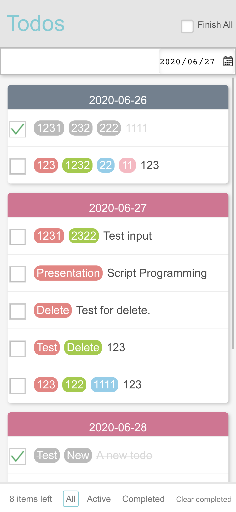
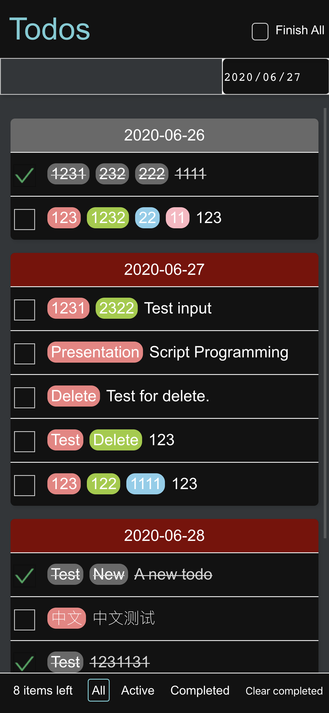
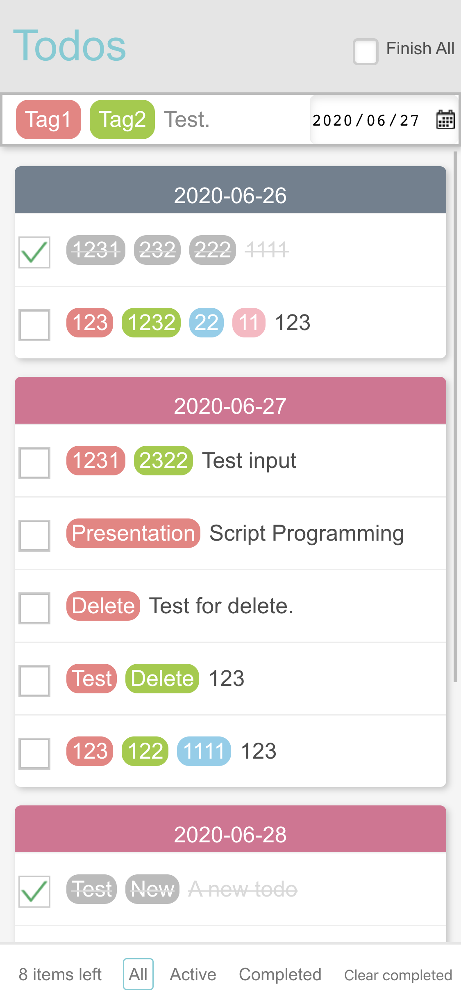
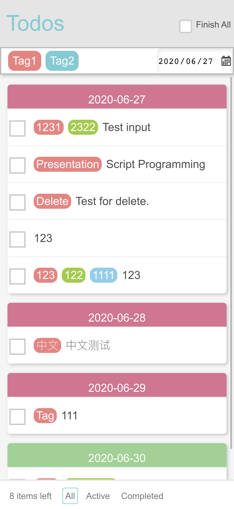
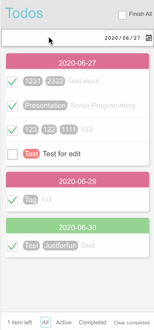
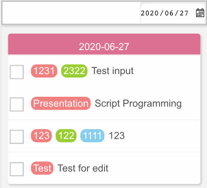
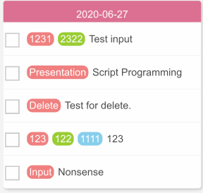
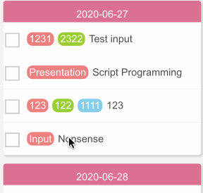
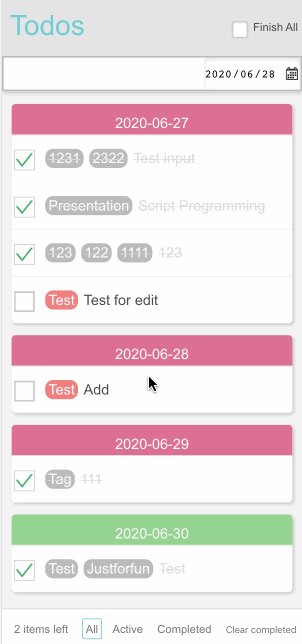
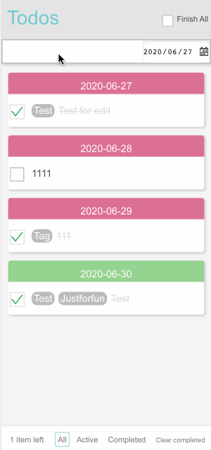

## Feature Implementation

### Basic Features

1. Add `Todo`

   Users can insert a new `todo` by entering information into the Input Field at the top of the interface and hitting Enter or, on iOS devices, tapping the Return key.

2. Delete `Todo`

   Users can delete a `todo` by swiping it to the left or right.

3. Display List

   The page provides instant feedback each time a user adds or removes a `todo`.

4. Complete/Uncomplete All

   Users can mark all todos as complete or incomplete by clicking the `Finish All` button at the top of the interface.

5. Delete Completed

   A `Clear completed` button appears at the bottom when some `todo` items are completed, clicking it will remove these items.

6. Toggle `todo` Item Status

   Users can change a `todo` item's status from incomplete to complete by clicking the checkbox to the left of an uncompleted `todo`, and vice versa.

### Advanced Features

1. Filter (`All`, `Active`, `Completed`)

   Users can filter the current `Todo` items by selecting a filter type at the bottom.

2. Edit a Single `todo`

   Users can edit a `todo` by double-clicking on it.

3. Save Page State

   The data is saved using localStorage. (Note: PUT, POST, GET, DELETE interfaces were implemented, mirroring HTTP Request Methods in a RESTful API style)

4. Set `todo` Deadline

   A `Date Picker` next to the input field allows users to set a deadline for `todo` items. Items are arranged according to the proximity of their deadlines, and color-coding distinguishes the urgency.

5. Set Custom Tags for `todo`

   When entering a `todo`, users can create a tag by typing a comma after a keyword, which automatically generates a tag distinguished by color, displayed in the list below.

6. Text Filtering (Search + Highlight Keywords)

   Users can initiate a search by typing a character sequence starting with `?` in the input field and hitting Enter. The search is case-insensitive and can locate keywords in Tags or `todo` text, with corresponding keywords highlighted.

7. Dark Mode

   The interface adapts to the browser/system's theme color (`prefers-color-scheme`), toggling between dark and standard modes accordingly.

## Design Highlights

1. Custom keyword entry is intuitive (separated by commas and automatically tagged, with highlighted keywords) for spotting vital information flexibly as opposed to standard high/medium/low urgency levels.
2. Text search within the `todo` list (including both text and tags) is made efficient through regular expressions, with highlighted feature words using `string.replace()` to add highlighted `` for quick information location.
3. Both features operate within a single input box to consider the limited screen size of mobile devices, avoiding clutter and preserving user experience by not overloading the page with components.
4. Swipe gestures for deletion are implemented for mobile user convenience.
5. Emulating mobile app design, the bottom filters and top header are fixed for quick navigation, even when the list of todos grows.
6. `todo` items are organized by deadline to clarify priorities.
7. A self-invoking function (akin to a Class) in `tags-input.js` defines tagging and text separation, with the webpage input boxes and editable `todo` items below as instances, allowing the reuse of code across components with distinct functions.

## References

- Tags input inspired by https://codepen.io/juliendargelos/details/MJjJZm
  - The method for tag input and deletion was particularly informative.
  - During implementation, the initialization process and event listeners (keyboard events and focus, blur events, etc.) were rewritten for integration.

- Extensive forum consultation, including StackOverflow and stackExchange.

## Feature Demonstration

1. Two Color Modes (Note: Dark mode is not as well adapted, and the layout is inconsistent with light mode, so it is recommended to test in light mode on computers or phones)

   | Light Mode            | Dark Mode            |
   |-----------------------|----------------------|
   |  |  |

2. Input and Deletion of Tags

   | Input Tag               | Confirm Deletion of Tag    |
   |-------------------------|----------------------------|
   |  |  |

3. Adding and Editing `todo`

   | Add `todo`              | Edit `todo`              |
       |-------------------------|--------------------------|
   |  |  |

4. Deletion of `todo`

   | Swipe Left to Delete    | Swipe Right to Delete    |
   |-------------------------|--------------------------|
   |  |  |

5. Two Filtering Methods (Text and Tags)

   | Text Filter           | Tag Search            |
   |-----------------------|-----------------------|
   |  |  |

