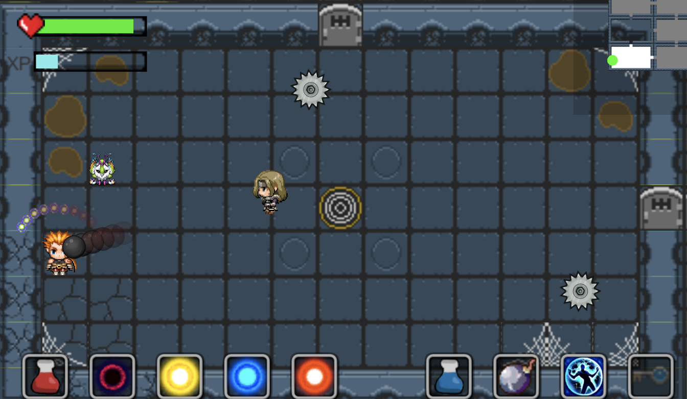
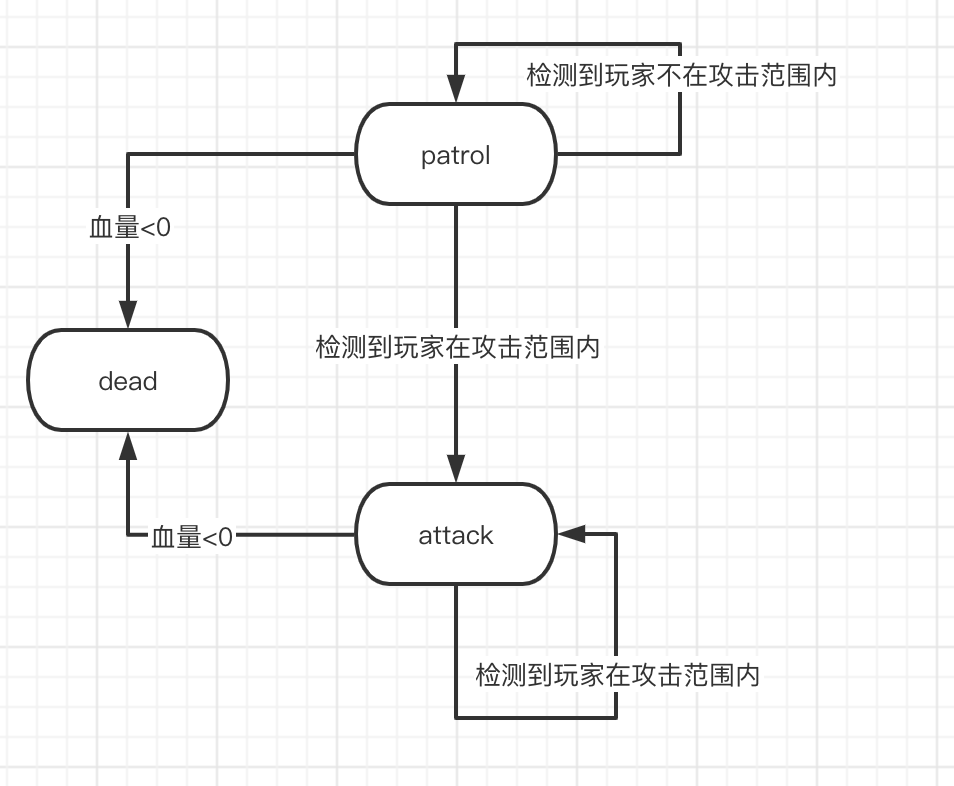
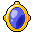

## Project Overview

This game started as a tribute to "Binding of Isaac," featuring a top-down dungeon crawler where players control a character who utilizes ranged attacks, melee strikes, and bombs to eliminate enemies. Throughout the gameplay, players collect items to strengthen themselves to face increasingly formidable foes.

### Game Background

During Ragnarok, the protagonist Týr faces off against the giants who wage war against the gods in Midgard, Álfheimr, and Hel:

- Fenrir, the gigantic wolf
- Jormungand, the World Serpent
- Hel, the Queen of the Underworld

### Development Tools

- Unity 2019.3.1f1

### Basic Interactions

| Key(s)      | Description        |
|:-----------:|:------------------:|
| W A S D     | Move character     |
| 1 2 3 4 5 6 | Switch bullet type |
| J           | Ranged attack      |
| Q           | Switch item        |
| T           | Shield             |
| F           | Use item           |
| Blank space | Melee attack       |

### Design Philosophy

#### Gameplay Design

Players navigate and clear levels using keyboard and mouse controls to direct their character's actions. Each level is composed of several rooms, with the objective to find the `Boss` room, defeat the `Boss`, and proceed to the next level. Completing all levels by defeating their respective `Bosses` is the victory condition. Within each room, players must eliminate all enemies to proceed to the next room.

Character movement is controlled by the keyboard, while abilities such as melee and ranged attacks, shield activation, and item usage can be executed via keyboard or mouse selection.

Various types of `Enemies`, `Bosses`, and traps challenge the players, who must utilize a combination of items, skills, and even terrain to overcome these obstacles efficiently.

Defeated `Enemies` and `Bosses`, as well as opened treasure chests, drop items that can strengthen the player’s attributes or provide beneficial effects.

Characters have a fixed maximum health and magic value. Health depletes to zero results in death, while ability usage consumes magic, which regenerates over time. Health does not regenerate naturally.

Upon death, characters restart from the first level but retain their enhanced attributes, allowing players to progressively strengthen their character through repeated gameplay.

#### Level Design

##### Midgard (Multiple waves of enemies)

The first level, Midgard, includes rooms with different enemy types like the DashEnemy that charges at the player and LaserEnemy that emits vertical lasers. The optimal strategy involves avoiding the initial charge and quickly eliminating one LaserEnemy to prevent significant damage when they converge at the center.


After the first set of enemies is defeated, a second wave appears, including a shooterEnemy and moving spikes. This design aims to challenge the player's avoidance patterns, as they typically retreat to corners when dodging projectiles.



Such multi-wave enemy setups throughout the game add complexity; even in rooms with randomly generated enemies, there's a chance for additional waves to enhance replayability.

##### Álfheimr (Swamp and spikes)


In this level, the surrounding swamp terrain slows the player's movement, which, in conjunction with a centrally placed laserEnemy, presents a tactical challenge.

Central pathways are lined with spike traps that deal damage when they emerge.


##### Álfheimr (Gears)

The second level's treasure rooms feature gears rotating clockwise. Players need to approach pots and use bombs to break them open to access the chests. The gear's rotation direction prevents players from passing through from below without taking damage.


##### Hel (Lava, Gears, and Spikes)

This level is set with lava around the edges, dealing damage over time if the player stands on it. The room's center has gears moving in various directions and spikes, requiring strategic thinking to navigate, especially with limited visibility under "fog of war" conditions.


The last two levels of the game feature more enemies and traps than the first, in line with the increased number of items players are likely to have picked up, thus scaling the difficulty appropriately.

## Feature Implementation

### Dungeon Room

The generation of the Dungeon Room is a central aspect of the game. This section delves into the logic behind room generation, the incorporation of special terrain features, and the principles behind procedural room generation.

#### Room

Leveraging the malleability and variety of Tilemaps, we've curated a selection of Tilemap assets (predominantly from RPG games) to design our maps.

Each room is constructed as a separate scene for two main reasons:

1. After finalizing a Room map, creating a new one is as simple as copying the original and making slight modifications.
2. For procedural generation, this allows for the random reuse of rooms.

Key GameObjects within a Room:

| Tilemap       | Order in Layer | Active by Default | Walkable | Description                                                                                              |
|---------------|----------------|-------------------|----------|----------------------------------------------------------------------------------------------------------|
| Terrain       | 0              | Yes               | Yes      | The floor of the room, essentially the base terrain.                                                     |
| Wall          | 1              | Yes               | No       | Primarily the surrounding walls, including impassable barriers.                                          |
| Decoration    | 2              | Yes               | Yes      | Decorative elements, such as spiderwebs and oil stains in the `Basement` map.                            |
| Door          | 1              | Yes               | Yes      | Doors at the perimeter of the room, fixed in the first level, dynamically set in procedural generations. |
| Locked Door   | 2              | No                | No       | Secures when enemies are present in the room.                                                            |
| SeparatedWall | 2              | No                | No       | Walls used for filling gaps in the autogenerated mode.                                                   |
| Treasure      | 2              | Yes               | No       | Chests that open automatically when approached.                                                          |
| Key           | 1              | Yes               | Yes      | Keys for unlocking doors, auto-collected when approached.                                                |
| Navmesh       | -              | Yes               | -        | Used for enemy pathfinding.                                                                              |
| Swamp         | 1              | Yes               | Yes      | Special terrain in the `Forest` map of the second level, slows down player movement.                     |
| Lava/Fire     | 1              | Yes               | Yes      | Special terrain in the `Hell` map of the third level, damages the player over time.                      |
| EndPoint      | 1              | No                | Yes      | The passage to the next level that becomes accessible after the Boss is defeated.                        |
| Spike         | Default        | Yes               | Yes      | Spike trap animations, deal damage to the player when triggered.                                         |
| Jar           | Default        | Yes               | No       | Breakable jars.                                                                                          |
| BornPos       | Default        | Yes               | -        | Coordinates for enemy spawn points, including patrol routes.                                             |
| outline       | Default        | Yes               | -        | Used to obscure room details on the mini-map.                                                            |
| wall2         | Default        | Yes               | -        | Displays the walls of a room on the mini-map.                                                            |

#### Terrain & Special Objects

This section covers the primary GameObjects and their associated scripts:

| GameObjects | Scripts | Description |
| --- | --- | --- |
|  | `Door.cs` | The `Door GameObject`'s `MonoBehaviour` in the first level. A `BoxCollider2D` acts as a Trigger on the door, which transitions the player to the corresponding room when entered. |
|  | `LockedDoor.cs` | In the treasure room of the first level, there is a locked door that requires a key to open. |
|  | `EndPoint.cs` | Displays the passage to the next level after the boss room. This script implements the scene transition. |
|  | `Treasure.cs` | Triggers a trigger to open the treasure chest and drop items when the player approaches. |
|  | `Swamp.cs` | The `MonoBehaviour` for swamp terrain. Slows down the player's movement upon entry. |
|  | `DamageOnStay.cs` | The `MonoBehaviour` for fire and lava terrain. Players lose health every second when stepping on magma and flames. |
|  | `Spike.cs` | The `MonoBehaviour` for spike traps. Spikes cause damage to the player when they emerge. |

#### Dungeon Room Controller

This part involves the main scripts:

| Scripts | Description |
| --- | --- |
| `Room.cs` | The `MonoBehaviour` for each room, recording basic room information (width, height, coordinates, doors), and providing basic set and get methods. |
| `RoomController.cs` | The room generator controller, which uses a singleton pattern. It records information of all rooms in the current world and offers methods for generating the current world's rooms and switching worlds. |

Here we mainly introduce the generation logic of the eight rooms in the first level `Basement`, which we retained after shifting to procedural generation:

1. `public void LoadRoom(string name, int x, int y)` (`RoomController`)
  - `string name`: The room's name, corresponding to the Scene's name added to the BuildSettings.
  - `int x, int y`: The room's coordinates, the specific coordinate relationship is shown in the figure below.
    
  - This function does not directly create the above rooms but creates a new room's information and adds these details to a queue called `loadRoomQueue`.

2. `void UpdateRoomQueue()` (`RoomController`)
  - This function is called every frame in `Update()` within `RoomController`.
  - It checks if a scene is currently loading; if not, it starts a coroutine that calls `LoadRoomRoutine()` to load the room.

3. `IEnumerator LoadRoomRoutine(RoomInfo info)` (`RoomController`)
  - `RoomInfo info`: The room information recorded in the `LoadRoom()` function.
  - The function asynchronously loads scenes using `SceneManager`'s `LoadSceneAsync()` method.

4. `public void RegisterRoom(Room room)` (`RoomController`)
  - After a scene is loaded in step three, as each Scene has a `Room MonoBehaviour`, its `Start()` method calls this function to register the room in `RoomController`.
  - This method saves the currently loaded room and performs some initialization operations.
  - Sets `isLoadingScene` to `false` indicating the current room has finished loading and initializing, ready to load a new room.

Thus, all the rooms in the current world have been loaded, and the logic of closing and opening doors (checking for enemies in the room), switching worlds, and special terrain damage, which are relatively simple, will not be explained here.

#### Procedural Dungeon Generator

In the last week, we rushed to work on the logic of the automatic generation of rooms according to the teacher's requirements. Let's first introduce the main scripts:

| Scripts | Description |
| --- | --- |
| `DungeonCrawler.cs` | Defines a crawler that continually returns a room coordinate in iterations. |
| `DungeonCrawlerController.cs` | The crawler control script, using a singleton pattern, controls multiple crawlers in a main loop. |
| `DungeonGenerator.cs` | The `Room`'s `MonoBehaviour`, retrieves positions obtained from the above crawlers, and randomly creates a room at this location. |
| `GenerationData.cs` | A `ScriptableObject`, carries data needed for the procedural generation, such as the number of rooms to generate. |

The core logic of procedural generation is as follows:

1. In `DungeonCrawlerController`, it starts by creating an initial room, and then it uses the `GenerationData` to determine the number of rooms to be generated.
2. Multiple `DungeonCrawler` instances work concurrently, each crawling and returning potential room coordinates.
3. `DungeonGenerator` takes these coordinates and instantiates a room prefab at each location, ensuring rooms do not overlap and creating a cohesive dungeon layout.

This procedural system has greatly diversified the game, increasing the replay value as each game's map is now unique.

### Enemy

#### Overall Class Design


- The diagram lists only the most critical methods and attributes.

#### Following AI

This AI is based on a state machine, with the state diagram as follows:


Behavior of the AI in different states:

| State     | Behavior                                                    |
| --------- | ----------------------------------------------------------- |
| **Idle**  | Initial state upon enemy spawn, transitions to Wander state |
| **Wander** | Randomly selects a point within the `wanderRadius` on the NavMeshSurface to move to; selects a new point every `wanderChangeInterval` |
| **Follow** | Pursues the player by setting the player's coordinates as the destination each frame |
| **Attack** | Each enemy has a unique attack mode, after attacking there is a specific cooldown period |
| **Die**    | On death, generates a death effect and drops items randomly before destroying itself |

#### Patrolling AI

The state diagram for this AI is as follows:



Behavior of the AI in different states:

| State      | Behavior                                                     |
| ---------- | ------------------------------------------------------------ |
| **patrol** | 1. Back and forth: Reverses direction at patrol endpoints <br>2. Looping: The end point of the patrol is also the starting point |
| **attack** | Maintains enemy movement while attacking                     |

#### Movement Modes

- Patrol, not using an agent

  - Set an array of patrol points `destinationList`, assume n points

    - Back and forth patrol: from 0 to n-1 to n-2 back to 0
    - Example: Patrolling enemy moves from PatrolS1 to PatrolS2 to PatrolE2 to PatrolE1 and back to PatrolS1

    

    - Looping patrol: from 0 to n-1(0) to 1 (similar design but with different start and end points)

- Seeking:

  - Early stages: Used Grid-based A* pathfinding for multiple units, but abandoned it due to two issues: 1. Enemies would overlap when there were too many 2. Diagonal movements often caused clipping or passing through walls, and later shifted to using NavMesh

      

  - Later stages: Adopted [NavMeshPlus](https://github.com/h8man/NavMeshPlus) for 2D pathfinding, setting an agent for each FollowingEnemyAi to automate pathfinding, with `stoppingDistance` in follow state set to `attackRange/2`, and `stoppingDistance` in wander state set to `0.5f`

    

#### Attack Methods

- Laser 1

  - The flashing aiming red line and the laser are implemented using `LineRenderer`
  - Continuously emits a laser, and every 0.1s uses `RaycastHit2D` to check for collision objects, determines the end of the laser based on the collision object type, and causes continuous damage to the player upon sustained hits

    

- Laser 2

  - Laser without aiming red line, the laser direction is perpendicular to the direction of movement and towards the player

      

- Bomb

  - The bomb targets the player's position at the time of launch, upon reaching the destination, it does not destroy the projectile, but starts a coroutine that allows the Bomb to grow in size until it explodes automatically after a certain time. During the bomb's trajectory or while it's growing, if the player comes into contact, it will trigger an explosion and damage.

  - The green block in the image is the bomb in flight, and the one with the ring is about to explode

      

- Standard Bullet

  - At launch, it takes the direction from the starting point to the player's coordinates, moving in that direction until it collides and is destroyed.

- Charge:

  - At the moment of attack, it sets the player's current coordinates as the destination, stops the agent's movement, and rapidly moves to the endpoint with `MoveTowards`. If the player is encountered along the path, damage is inflicted.


#### Damage Effects

- Pop-up Damage Numbers

  Whenever damage is taken, damage numbers pop up diagonally upwards using **TextMeshPro**. These numbers have a fade-out time during which they move in the set direction, continuously growing until they shrink and disappear after hitting a certain time threshold.

- Enemy Flicker: (lps)

#### Generation Methods

There are primarily two methods:

1. Random Generation: Within a room, using the room's center, a generation radius is established. Based on the number of enemies to be generated, they are spawned at evenly spaced intervals at positions covered by the navmesh.

2. Fixed Routine Generation: In each room, the type of enemies and their spawn positions for each wave are predetermined. In non-random scenarios, enemies spawn in the arranged order. In random scenarios, the next wave is randomly selected from subsequent waves, starting from wave i. Notably, bosses are always spawned at the center of the room.

    

Different waves of enemies are distinguished using color-coded tags, and a ScriptableObject (SpawnerData) asset is created for each enemy type in every level.

  

#### Boss

|                   | Level 1             | Level 2             | Level 3             |
| ----------------- | ------------------- | ------------------- | ------------------- |
| GameObjects       |  |  |  |
| Skills            | Single-shot, 360° spread, Splitting | Shield, Regeneration, Full-screen Attack | Full-screen Attack, 360° Spread, Shield, Regeneration, Splitting |

| Skill          | Description                                                  |
| -------------- | ------------------------------------------------------------ |
| Full-screen Attack | An unavoidable attack covering the entire screen, preceded by the boss turning red and charging up. The screen shakes during the attack. |
| Shield         | While the shield is active, the boss cannot be damaged.       |
| Splitting      | Upon death, the boss splits into 4 smaller bosses.           |
| Regeneration   | Boss quickly regains health.                                 |
| Single-shot    | Boss fires a single random bullet in the player's direction.  |
| 360° Spread    | Boss shoots a series of random bullets around itself after a delay. |

**Full-screen Attack Effect**: Implemented with camera shake (ScreenShakeController.cs)

Camera updates happen in LateUpdate() as it's called after all Update functions, making it suitable for camera updates.

| Attribute          | Description                                               |
| ------------------ | --------------------------------------------------------- |
| shakePower         | Displacement distance in horizontal and vertical directions, gradually decreasing to zero. |
| shakeFadeTime      | Duration of the shaking effect.                            |
| shakeRotation      | Camera rotation angle around the z-axis, gradually decreasing to zero. |
| shakeTimeRemaining | Countdown timer for the shaking effect.                    |

**Shield (ShieldController.cs)**:

The shield animation is created using particle effects.

- Activate shield: Play the particle system and set the radius of CircleCollider2D to form the protective barrier.
- Deactivate shield: Stop and clear the particle effect, and set CircleCollider2D's radius to zero.

  

**Splitting**:

- When a splittable boss's health drops below zero, during the Die state, four points within the room are randomly selected within a radius 1.5 times the boss's size on the Navmesh to spawn the split mini-bosses before the original boss is destroyed.

**Regeneration**:

- Effect: The boss's outline turns green, and its health gradually recovers during a coroutine.

#### Enemy Attributes

##### Follow-Type Common Enemies

In the game, follow-type enemies are divided into 4 categories based on their attack methods, with each category featuring different appearances in each level:

- Bomb Class:
  - Basic Attributes: High health, large attack range, long attack intervals.
  - Attack Method: Throws a bomb towards the player, which slowly expands before exploding after reaching its destination.
- Charge Class:
  - Basic Attributes: Low health, small attack range, quick direction changes.
  - Attack Method: Rapidly charges towards the player when within attack range.
- Laser Class:
  - Basic Attributes: Average health, large attack range, long attack intervals.
  - Attack Method: Aims a laser sightline at the player's current position before firing, dealing sustained high damage.
- Shooting Class:
  - Basic Attributes: Low health, medium attack range, short attack intervals.
  - Attack Method: Fires projectiles directly at the player's position with moderate speed.

| Level | BombEnemy | DashEnemy | LaserEnemy | ShootEnemy |
|-------|-----------|-----------|------------|------------|
| 1     |  |  |  |  |
| 2     |  |  |  |  |
| 3     |  |  |  |  |


| Enemy             | Type         | Health      | Speed | Attack Range |
|-------------------|--------------|-------------|-------|--------------|
| BombEnemy         | Ranged       | 12          | 1     | 6            |
| DashEnemy         | Dash         | 8           | 1     | 4            |
| LaserEnemy        | Laser        | 10          | 1     | 7            |
| LaserPatrolEnemy  | Patrol       | 10          | 1     | 5            |
| ShootEnemy        | Shooting     | 10          | 1     | 5            |
| Boss              | Boss         | 60/120/200  | 3     | 6            |
| SplitedBoss       | Splited Boss | 40          | 3     | 4            |

| Enemy             | Range | Cool Down | Wander Radius | Wander Change Interval |
|-------------------|-------|-----------|---------------|------------------------|
| BombExtra         | 10    | 3         | 3             | 2                      |
| DashExtra         | 8     | 2         | 4             | 1                      |
| LaserExtra        | 12    | 3         | 4             | 2                      |
| ShootExtra        | 8     | 2         | 3             | 1                      |
| BossExtra         | 20    | 1         | 4             | 1                      |
| SplitedBossExtra  | 20    | 2         | 4             | 1                      |

##### Patrol-Type Regular Enemies

| Type               | Appearance                                                  |
|--------------------|-------------------------------------------------------------|
| LaserPatrolEnemy   |  |
| PatrolObstacle     |     |

#### Sound Design

The game's auditory experience is crafted to heighten immersion, featuring:

- Dynamic background music that changes tempo and intensity based on the player's health and the number of enemies.
- Distinctive sound effects for different enemy attacks, with variations in pitch and volume depending on distance from the player.
- Voice-over for the player character and NPCs, adding personality and enhancing the narrative aspect.
- Environmental sounds that respond to player actions, such as footsteps changing on different surfaces, or echoes in cavernous areas.


### Companion

State diagram:


Behaviors in different states:

| State     | Behavior                                                       |
|-----------|----------------------------------------------------------------|
| Active    | Follows player, heals, attacks the nearest enemy, blocks all enemy ranged attacks |
| NotActive | Follows player, heals, blocks all enemy ranged attacks         |
| Idle      | Follows player, blocks laser attacks                           |

Attributes:

| Attribute                    | Description                               | Value |
|------------------------------|-------------------------------------------|-------|
| speed                        | Movement speed                            | 2.5   |
| fireDelay                    | Delay between attacks                     | 2     |
| maxHealth                    | Maximum health                            | 20    |
| healInterval                 | Interval between healing                  | 2.5s  |
| healthPercentageToBeActive   | Minimum health percentage to remain active | 50%   |
| idleTime                     | Time spent in idle state                  | 8s    |

Movement:

- When the player moves: Move towards the player at `speed`, recording the horizontal and vertical distances moved by the player each frame.
- When the player is stationary: Move to the position where the player was last stationary.

Attacking and health recovery:

- Both are performed through continuous coroutines (unless destroyed), which are relatively straightforward and not detailed here.

### Item System

The item system mainly involves item generation, pickup, and usage, with related scripts being `ItemSpawner.cs`, `CollectionController.cs`, `GameController.cs`, and `PlayerController.cs`.

#### Items

There are two main categories of items: buff items and use items. Buff items take effect immediately upon pickup by the player, while use items are stored in the inventory for the player to use at their discretion.

| GameObjects                                 | Name                 | Type   | Description                                                                 | Weight |
|---------------------------------------------|----------------------|--------|-----------------------------------------------------------------------------|--------|
|  | Healing Potion       | `Buff` | Heals the player for `4` HP.                                                | `0.3`  |
|        | Speed Boot           | `Buff` | Increases the player's speed by `0.02`.                                     | `0.1`  |
| | Strengthen Screw     | `Buff` | Strengthens player's attack by `0.02`, including bullet size, fire rate, and speed | `0.1`  |
|  | Invisibility Potion | `Use`  | Makes the player stealth for `8` seconds.                                   | `0.05` |
|  | Time Stop Potion     | `Use`  | Stops enemies for `8` seconds.                                              | `0.05` |
|  | Bullet Splitation   | `Buff` | Increases the player's bullet split by `2`.                                 | `0.0`  |
|         | Bomb                 | `Use`  | Sets a bomb at the player's position, exploding in `3` seconds.             | `0.1`  |
|      | Cruise Orb           | `Buff` | Generates `1-2` cruise bullets that can deal `4` rounds of damage around the player. | `0.3`  |

Item control is mainly managed by `CollectionController.cs`, which overrides `OnTriggerEnter2D()` to detect player's collision and pickup.

#### Item Spawner

Items drop randomly upon an enemy's death based on the weight of each item listed in the table above. Items with a weight of `0` are special drops, such as from treasure chests.

`ItemSpawner` is designed as a `Prefab` for generating items, controlled by `ItemSpawner.cs`, which stores the items and their corresponding weights listed in the table. When an `Enemy` dies or `Treasure` is opened, an `ItemSpawner` is generated and calls `dropItemAfterEnemyDeath()` or `dropTreasure()` to produce items.

#### Item Use

Item usage mainly involves `PlayerController.cs` and `GameController.cs`.

For `Buff` items, picking up the item triggers a static function `Buff()` in `GameController.cs` to modify the player's attributes.

For `Use` items, picking them up adds the item information to a list `storageItems` maintained by `GameController.cs`. When the player switches or uses an item manually, `PlayerController.cs` calls static functions `ChangeItems()` or `UseItems()` in `GameContoller.cs` to modify and maintain game information.

#### Player Related Operation

Player interaction with items is as follows:

- Collision with an item triggers pickup.
- Pressing `Q` switches items.
- Pressing `F` uses the current item.

### Bullet System

The Bullet System (Attack System) mainly involves the `BulletController.cs`, `BombController.cs`, and `PlayerSwapWenpons.cs` scripts.

The Bullet System utilizes `BulletController.cs` to manage bullets from both `Enemy` and `Player`, distinguishing them with the `isEnemyBullet` flag. For swapping `Player` bullets, `PlayerSwapWenpons.cs` is employed to manage the bullet (weapon) types for the `Player`.

#### Bullet

| GameObjects                                                  | Type              | isEnemyBullet | Description                                                  |
| ------------------------------------------------------------ | ----------------- | ------------- | ------------------------------------------------------------ |
|                                | Normal & Bullet   | `False`       | Standard Bullet fired by `Player`, inflicting `2` damage without expending XP |
|                            | Normal & Thunder  | `False`       | Thunder Bullet launched by `Player`, causes `3` damage and paralyzes `Enemy` for `1` XP |
|                              | Normal & Water    | `False`       | Water Bullet shot by `Player`, deals `3` damage and reduces `Enemy` movement and attack speed, costing `1` XP |
|                               | Normal & Fire     | `False`       | Fire Bullet fired by `Player`, delivering `1/s` damage over `4` seconds for `1` XP |
|  | CruiseBullet      | `False`       | Cruise Bullet generated upon collecting `Cruise Orb`, inflicting `2` HP damage `4` times |
|                             | PlayerBomb        | `False`       | Bomb that can be deployed by collecting the `Bomb` item. Explodes after `3` seconds, dealing `5` damage to both `Enemy` and `Player`. |
|                                  | Sword             | `False`       | Sword Bullet is an alternative attack used by `Player`, capable of dealing `4` damage through walls |
|                                 | Normal            | `True`        | Regular Bullet discharged by `Enemy`, causing `2.5` damage    |
|                             | Projectile        | `True`        | Bullet that can rebound off walls, inflicting `2.5` damage   |
|                               | Tracking          | `True`        | Bullet capable of homing in on the `Player`, with `2.5` damage |
|                                 | Slalom            | `True`        | Bullet that can zigzag and hit twice, each time dealing `2.5` damage |
|                              | EnemyBomb         | `True`        | Bullet that explodes upon timer expiry or upon contact with `Player`, dealing `5` damage. |

#### Bullet Controller

Controls bullet behaviors, within `Update()`:

- Logic for `CruiseBullet` rotation
- Swinging logic for `Sword`
- Homing logic for `Tracking`
- Zigzagging logic for `Slalom`
- Explosion logic for both `EnemyBomb` and `PlayerBomb`
- Rebounding logic for `Projectile`

Controls bullet collision logic, within `OnTriggerEnter2D()`:

- Damage effects of `NormalBullet`
- Paralysis effects of `Thunder`
- Slowing effects of `Water`
- Burning effects of `Fire`
- Damage effects of `Enemy` bullets on `Player`

### Animation


The state machine for the four-directional movement animations of the player and small monsters is depicted above, with eight states encompassing the four idle and four walking directions. State transitions are controlled by two parameters: `xSpeed` and `ySpeed`.

- When `|ySpeed| > 0.01`, the state machine transitions from one of the four Idle states to either Up Walk or Down Walk.
- When `|xSpeed| < 0.01` and `|ySpeed| < 0.01`, it transitions from the Idle states to either Left Walk or Right Walk.
- When `|ySpeed| < 0.01` or `|xSpeed| < 0.01`, it shifts from a Walk state back to the corresponding Idle state.

Additionally, direction is determined by the sign of the speed variables, with positive values indicating right or up, and negative values indicating left or down.

### Special Effects

The game features a variety of special effects, including:

- Green flashing light effect for `Player` health regeneration
- Red flashing light effect when the `Player` is injured
- Outline effect for `Player` when receiving a `Buff`
- Invisibility effect for `Player` using an invisibility potion
- Red flashing light effect when an `Enemy` is damaged
- Trailing effect for `DashEnemy` during dash
- Outline effect for `Boss` when activating skills
- Trailing effects for certain `Bullets`

#### Shader Graph

Based on the tutorial from [CodeMonkey](https://unitycodemonkey.com/video.php?v=dKsqupXLuSU).

Using the `URP` rendering pipeline, shaders are crafted with `ShaderGraph`. To simplify use, effects for flickering, outline, and invisibility are combined into a single `ShaderGraph` for easy access.


#### Sprite Trail

Utilized the [Sprite Trail](https://readme_assetstore.unity.com/packages/tools/particles-effects/sprite-trail-80203) plugin from the `Unity Asset Store`.

### UI

#### HP, XP Bar

Under the canvas, a slider is created as the Health Bar, complete with a border and a heart-shaped decoration on the left,


The Fill is set to red:


The Health Bar is connected to a script to manage the value. This script provides a function `SetHealth` to control the health bar's value, and uses a gradient to change the bar's color at different stages.


The XP bar functions similarly, with adjusted fill color and decorations.

#### Mini Map

An additional camera, `MinimapCamera`, is used. Its output is set to a texture and assigned to `MinimapRenderTexture`. A new `Minimap` layer is created, with its `cullingMask` set to `Minimap`, the background set to a solid color, and the color set to black. `MinimapCamera` is made a child of `MainCamera` to update the minimap position accordingly.


A new `Raw Image` is created, with the texture set to `MinimapRenderTexture`, positioned in the top right corner of the screen.


Under `Player`, a child `SpriteRenderer` named `MinimapIcon` is created and placed on the `Minimap` layer to be visible only to the `Minimap Camera`. This makes the `Player` appear as a green dot on the minimap.


Similarly, each `Room` has a `SpriteRenderer` named `outline` with a `Square` sprite, sized to the room and placed on the `Minimap` layer. An additional copy of the room's walls, named `wall2`, is also placed on the `Minimap` layer. The final result is as follows:


In the `RoomController`, the `OnPlayerEnterRoom` function updates the room's outline to white when the player enters and to grey when they leave, to highlight the current room.

The final effect is displayed in the top right corner as shown below:


### Fog of War

Create two Textures: `FogOfWarMain` and `FogOfWarSecondary`. Establish two Cameras as well: `FogOfWarMainCamera` and `FogOfWarSecondaryCamera`. Formulate two new layers, `FogOfWarMain` and `FogOfWarSecondary`, setting the culling mask of `FogOfWarMainCamera` to `FogOfWarMain`, its output type to texture, and targeting `FogOfWarMain`. If possible, set clear flags to 'don't clear'.

For the `FogOfWarSecondaryCamera`, assign the culling mask to `FogOfWarSecondary`, background to solid color, and output texture to `FogOfWarSecondary`.


Under the Player, create two child objects named `FogOfWarMainCircle` and `FogOfWarSecondaryCircle`, both with circle sprites. Color the `FogOfWarMainCircle` red and place it on the `FogOfWarMain` layer; color the `FogOfWarSecondaryCircle` blue and set it on the `FogOfWarSecondary` layer.


Initiate a `FogOfWarCanvas`, setting its render mode to world space, event camera to the main camera, and its sorting layer to the highest priority, `Fog of War`, to render it atop all objects.


On the canvas, introduce a raw image, applying the `FogOfWarMain` texture. Employ a shader to overlay the colors of the two circles, yielding the following effect:


The `FogOfWarMainCamera` leaves a trail on the `FogOfWarMainTexture` since it's set to 'don't clear', while the `FogOfWarSecondaryCamera`, not set to 'don't clear', renders only at the current location. The overlay of blue and red creates purple.

Pen another shader to process the colors around the player's region in the two textures (red and blue) to return an alpha value, achieving a transparent effect around the player.

```glsl
fixed4 frag (v2f i) : SV_Target
{
    fixed4 col = tex2D(_MainTex, i.uv) + tex2D(_SecondaryTex, i.uv);
    // red = 1, blue = 1, we want alpha 0;
    // red = 1, blue = 0, we want alpha 0.5;
    // red = 0, blue = 0, we want alpha 1;
    col.a = 2.0f - col.r * 1.5f - col.b * 0.5f + col.g;
    return fixed4(0,0,0,col.a);
}
```

Using a traditional rendering pipeline, if `FogOfWarMainCamera`'s clear flags are set to 'don't clear', no color or depth buffers are cleared, layering each frame over the next, creating a smearing effect. This allows for a fog dispersal effect over areas traversed:


However, due to the extensive use of ShaderGraph and the URP rendering pipeline in our project, the fog clearing function cannot be used. The final effect is depicted as follows:


